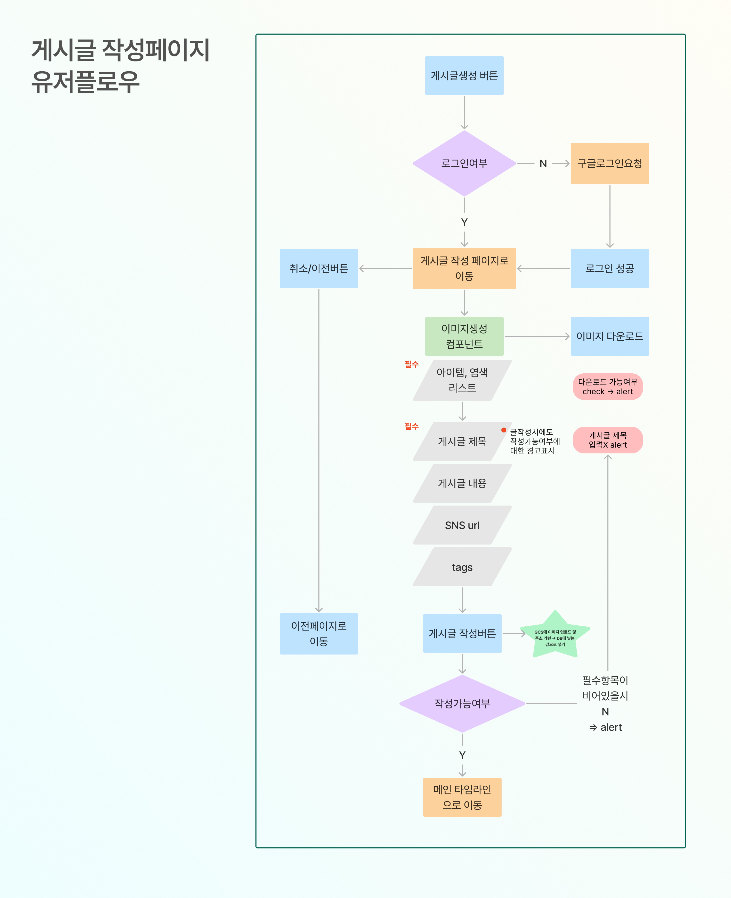
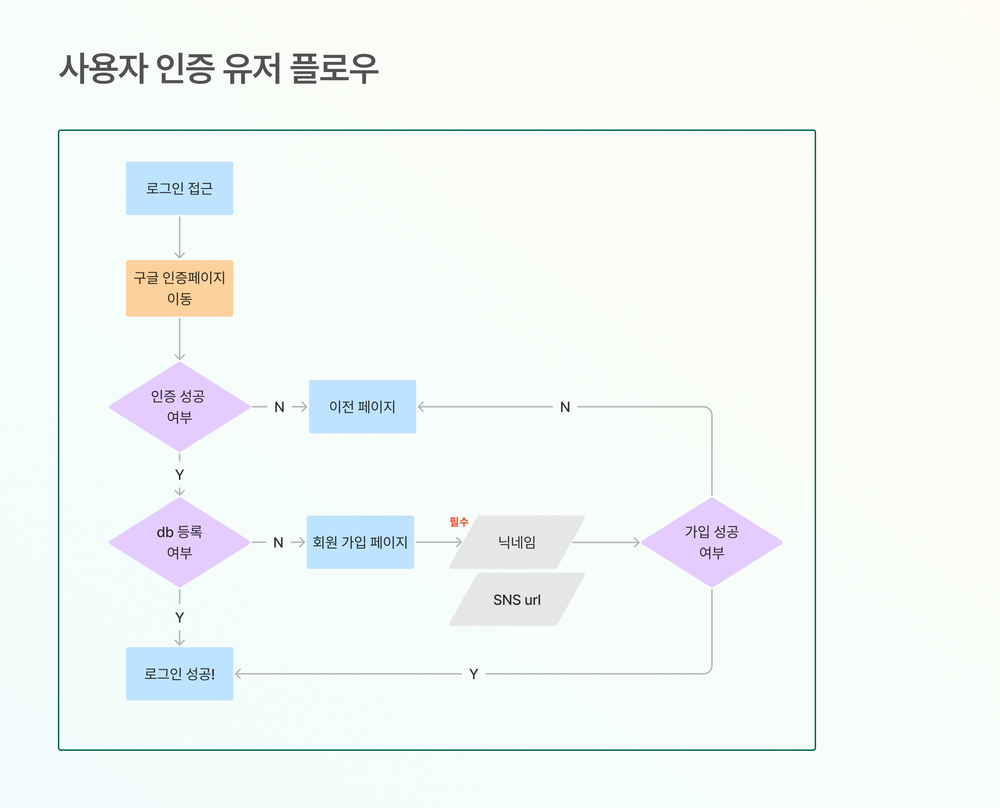
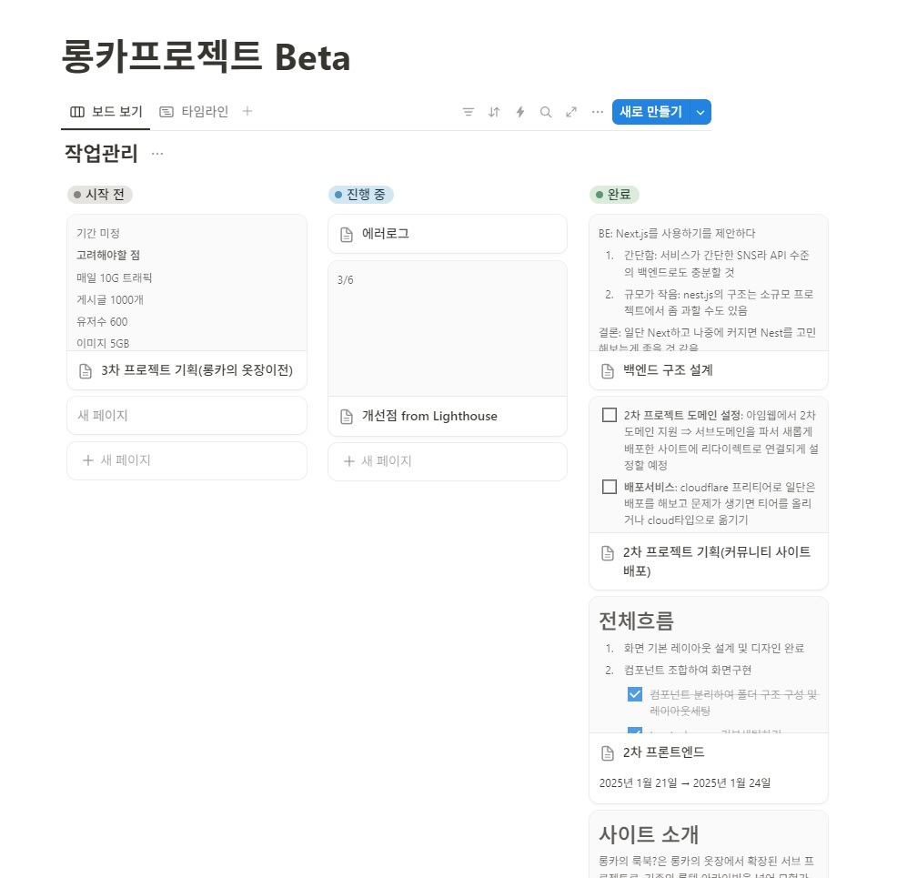
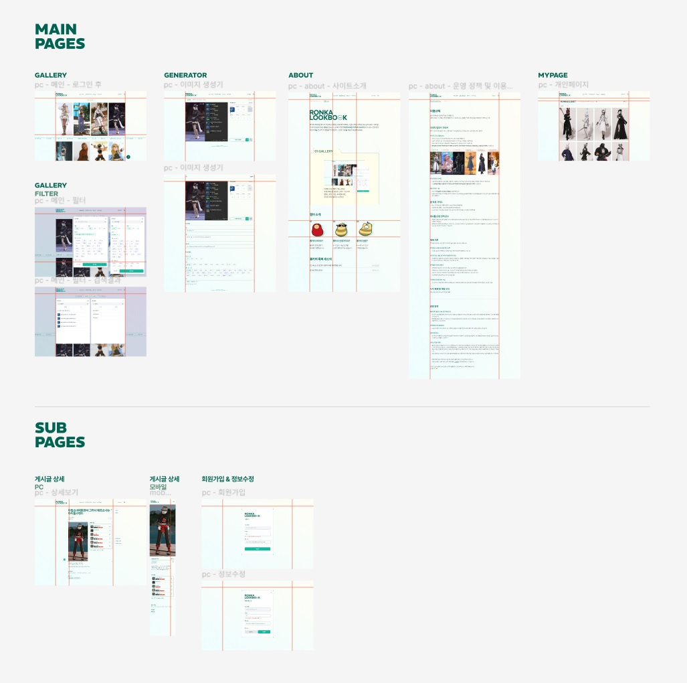
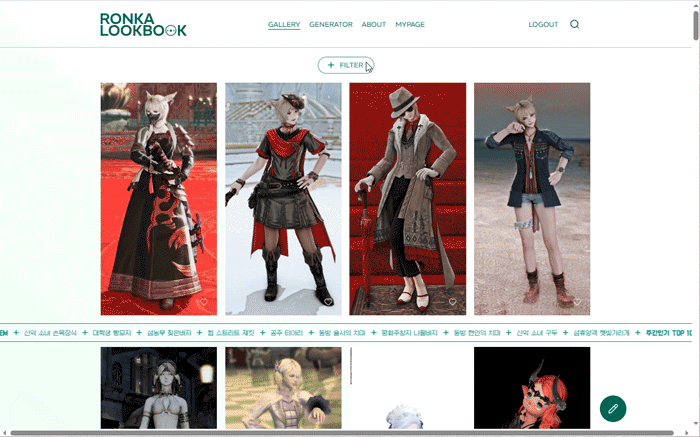
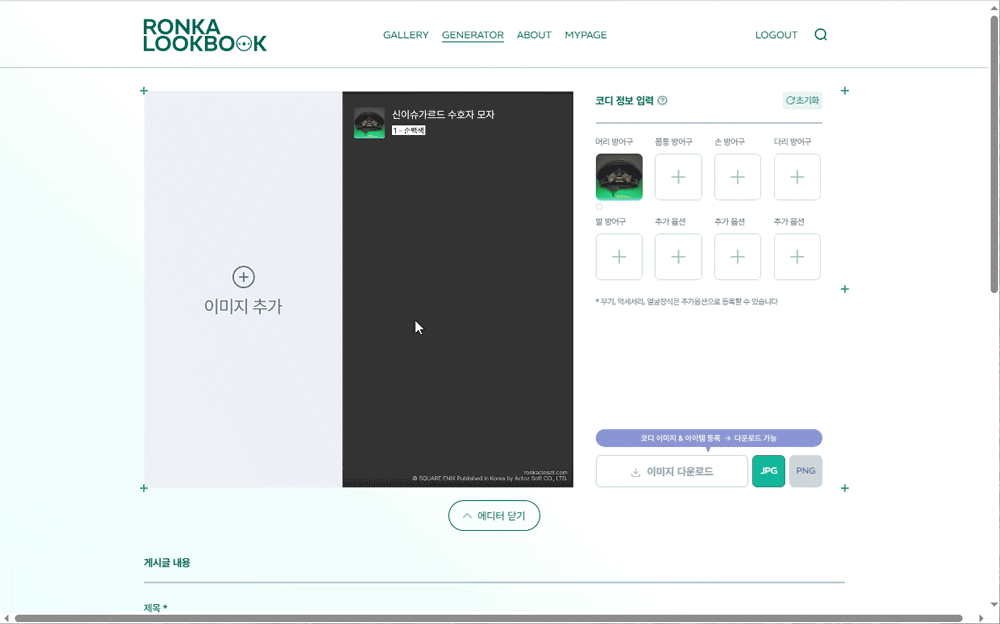
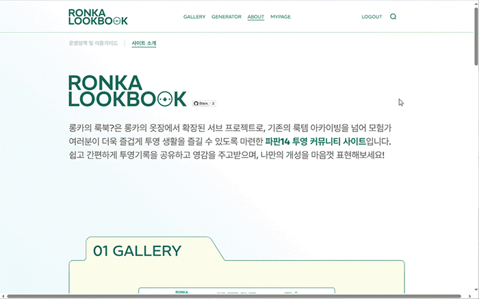
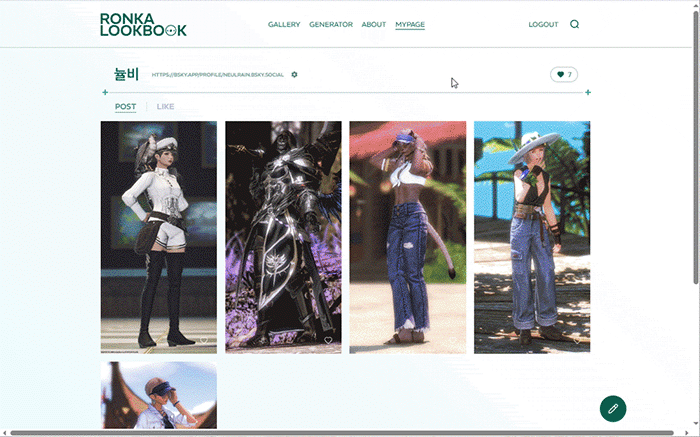

 

## 프로젝트 소개

본 프로젝트는 [롱카의 옷장?](https://ronkacloset.com/) 서브 프로젝트로, 간단하게 <strong>파이널판타지14의 코디 이미지를 생성하여 백업 & 자랑</strong>할 수 있는 커뮤니티입니다.
1차 프로젝트 [🔗FFXIV-KOR MIRAPRI GENERATOR(Github)](https://github.com/tomatto0/Ronka-Mirapri)의 투영기록 생성기는 Generator Page에 포함되었습니다.

### 작업기간

2025/1/15 ~ 2024/2/28(1차 배포)

 

## 주요 기술 요약

#### GCS를 통한 이미지 관리

- <strong>Google Cloud Storage (GCS)</strong> 를 활용한 이미지 업로드, 저장 및 관리 시스템 구축
- 업로드된 이미지의 최적화 (WebP 변환, 크기 조정 등)
- Next.js API Routes를 이용한 이미지 업로드 핸들링

#### NextAuth를 통한 권한 관리

- NextAuth.js를 이용한 세션 기반의 인증 시스템
- Google OAuth 2.0 API를 통한 유저 인증 시스템 구축
- 사용자 역할(Role) 및 권한(Role-based Access Control) 관리

#### Infinite Scroll 구현

- useInfiniteQuery를 활용한 데이터 무한 로딩
- Intersection Observer를 활용한 최적화된 스크롤 감지
- 서버에서 페이지네이션 API를 이용한 효율적인 데이터 로딩

 

## Skills

## 팀원 소개

  
|||
|:---:|:---:|
| [최수진](https://github.com/tomatto0) | [박건](https://github.com/C-dtd) |

 

## Flow chart

게시글 작성페이지 유저플로우

사용자 인증 유저 플로우 

## 📙 기획 문서

프로젝트 노션

[🔗 Notion 바로가기](https://ronkacloset.notion.site/Beta-16dd5a9efb39804a8e52dc6c8328e950?pvs=4)

FIGMA

[🔗 FIGMA 바로가기](https://www.figma.com/design/oLdBoGe63T621vBKE7AGfz/Ronka-Lookbook-%ED%99%94%EB%A9%B4%EA%B8%B0%ED%9A%8D%EC%84%9C-%EC%99%B8%EB%B6%80%EA%B3%B5%EA%B0%9C%EC%9A%A9?node-id=0-1&t=2ZIdVStu032G3MuN-1)

 

## 페이지 주요 기능

### GALLERY

- 필터기능을 사용해서 원하는 종족, 직업, 아이템에 맞는 코디만 볼 수 있습니다.
- 주간인기 TOP 10 아이템 리스트를 롤링으로 제공하고, 클릭시 해당 아이템을 사용한 코디만 볼 수 있습니다.
- sessionStorage를 활용해 필터상태를 저장하여 새로고침 후에도 설정한 필터링 상태가 유지되게 하였습니다.

 

### GENERATOR

- 스크린샷과 함께 장착한 아이템을 하나의 이미지(jpg, png중 선택)로 저장할 수 있습니다.
- 하단의 에디터를 사용해 스타일 노트를 작성해 나만의 룩북을 안전하게 백업할 수 있습니다.
- IndexedDB를 통해 이미지와 에디터에 입력된 정보를 관리해 사용자가 화면을 새로고침하거나 닫아도 데이터가 유지됩니다.

 

### ABOUT

- 사이트의 운영정책 및 이용가이드와 간단한 사이트소개

 

### MYPAGE

- 로그인시에 접근할 수 있는 개인페이지로, 작성한 글과 좋아요한 코디 모아보기, 회원정보 수정이 가능합니다.
- 자신의 게시글이 받은 총 좋아요수도 상단에서 확인가능합니다.
